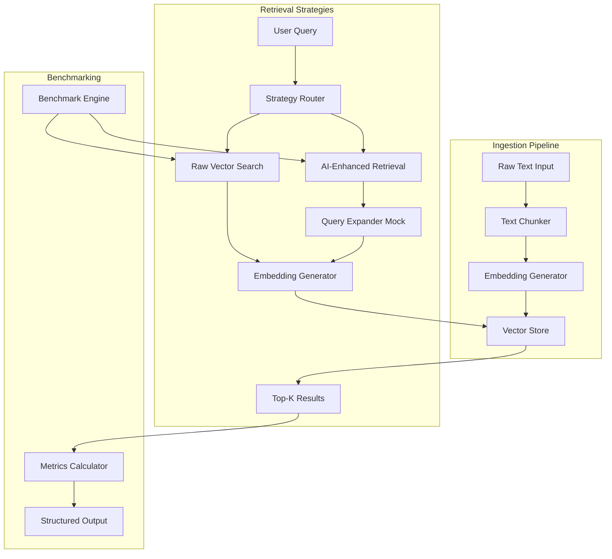

# Design Document: Context-Aware Retrieval Engine

## Overview

The Context-Aware Retrieval Engine is a local RAG (Retrieval-Augmented Generation) pipeline that demonstrates semantic search capabilities without cloud dependencies. The system provides a complete implementation of vector-based retrieval with two distinct strategies: direct similarity search and AI-enhanced query expansion.

### Key Design Goals

1. **Local-First Architecture**: All components run locally using open-source libraries (sentence-transformers, FAISS/ChromaDB) to eliminate API costs and ensure data privacy
2. **Dual Retrieval Strategies**: Implement both raw vector search and AI-enhanced retrieval to enable comparative benchmarking
3. **Cloud Migration Path**: Design with Vertex AI compatibility in mind, using mocks that mirror production API interfaces
4. **Modular Design**: Separate concerns into distinct modules (embedding, storage, retrieval) for maintainability and testability
5. **Benchmarking Focus**: Built-in comparison framework to quantify retrieval effectiveness across strategies

### System Context

The engine operates entirely within a Python environment, processing technical documentation (5-10 paragraphs) to build a searchable knowledge base. It serves as both a functional RAG system and a learning platform for understanding vector search mechanics before migrating to production cloud services.

### Research Summary

Based on current best practices in vector search and RAG systems:

- **Sentence-Transformers**: The `all-MiniLM-L6-v2` model provides a good balance of speed and quality for semantic embeddings, producing 384-dimensional vectors. Models trained with cosine similarity should use cosine similarity for retrieval ([source](https://www.pinecone.io/learn/vector-similarity/)).

- **Vector Database Selection**: FAISS offers the fastest in-memory search performance with GPU acceleration support, while ChromaDB provides developer-friendly APIs with built-in persistence. For datasets under 1000 chunks, both perform adequately, but FAISS has lower memory overhead ([source](https://huggingface.co/rag-experiments/VectorDB-Benchmarks)).

- **Similarity Metrics**: Cosine similarity is preferred for normalized embeddings as it measures directional alignment regardless of magnitude. This is standard for sentence-transformers models. Euclidean distance is sensitive to vector magnitude and better suited for clustering tasks ([source](https://metricgate.com/blogs/cosine-vs-euclidean-similarity/)).

- **Query Expansion**: Modern RAG systems use LLMs to rewrite queries by clarifying intent, adding synonyms, or decomposing complex questions into sub-queries. This addresses the "query-document mismatch" problem where user questions don't match document phrasing ([source](https://tianpan.co/blog/2026-04-26-query-rewriting-rag-retrieval-shape)).

## Architecture

### High-Level Architecture



### Component Responsibilities

1. **Embedding Generator** (`embedding.py`)
   - Wraps sentence-transformers model
   - Provides consistent interface matching Vertex AI TextEmbeddingModel
   - Handles both single and batch text encoding
   - Manages model initialization and caching

2. **Vector Store** (`storage.py`)
   - Abstracts vector database operations (FAISS/ChromaDB/NumPy)
   - Implements add, search, and persistence operations
   - Manages similarity metric configuration
   - Maintains text-embedding associations

3. **Retrieval Strategies** (`retrieval.py`)
   - **Raw Vector Search**: Direct query embedding → similarity search
   - **AI-Enhanced Retrieval**: Query expansion → embedding → similarity search
   - Common interface for strategy interchangeability

4. **Query Expander** (`mocks.py`)
   - Mocks Vertex AI GenerativeModel behavior
   - Implements rule-based query expansion (synonym addition, clarification)
   - Logs all interactions for debugging
   - Supports dependency injection for testing

5. **Orchestrator** (`orchestrator.py`)
   - Coordinates ingestion pipeline (chunk → embed → store)
   - Routes queries to appropriate retrieval strategy
   - Manages component lifecycle and configuration

6. **Benchmark Engine** (`benchmark.py`)
   - Executes predefined query sets against both strategies
   - Collects retrieval results, similarity scores, and latency metrics
   - Calculates quality metrics (average similarity, diversity, overlap)
   - Outputs structured comparison reports

### Design Patterns

- **Strategy Pattern**: Retrieval strategies implement common interface for interchangeable execution
- **Dependency Injection**: All components accept dependencies via constructor for testability
- **Adapter Pattern**: Mocks adapt local implementations to match Vertex AI interfaces
- **Factory Pattern**: Vector store creation based on configuration (FAISS/ChromaDB/NumPy)

## Components and Interfaces

### Embedding Generator Interface

```python
class EmbeddingGenerator:
    """Generates vector embeddings from text using sentence-transformers."""
    
    def __init__(self, model_name: str = "all-MiniLM-L6-v2"):
        """Initialize with specified sentence-transformers model."""
        
    def encode(self, texts: Union[str, List[str]]) -> np.ndarray:
        """
        Generate embeddings for input text(s).
        
        Args:
            texts: Single string or list of strings
            
        Returns:
            numpy array of shape (n, embedding_dim) where n is number of texts
        """
        
    def get_embedding_dimension(self) -> int:
        """Return the dimensionality of generated embeddings."""
```

### Vector Store Interface

```python
class VectorStore(ABC):
    """Abstract interface for vector storage backends."""
    
    @abstractmethod
    def add(self, embeddings: np.ndarray, texts: List[str], metadata: Optional[List[Dict]] = None):
        """Store embeddings with associated text and metadata."""
        
    @abstractmethod
    def search(self, query_embedding: np.ndarray, k: int = 3) -> List[SearchResult]:
        """
        Find k most similar embeddings.
        
        Returns:
            List of SearchResult(text, score, metadata)
        """
        
    @abstractmethod
    def save(self, path: str):
        """Persist vector store to disk."""
        
    @abstractmethod
    def load(self, path: str):
        """Load vector store from disk."""

class FAISSVectorStore(VectorStore):
    """FAISS-based implementation with IndexFlatIP for cosine similarity."""
    
class ChromaDBVectorStore(VectorStore):
    """ChromaDB-based implementation with built-in persistence."""
    
class NumpyVectorStore(VectorStore):
    """Simple NumPy-based implementation for small datasets."""
```

### Retrieval Strategy Interface

```python
class RetrievalStrategy(ABC):
    """Abstract interface for retrieval strategies."""
    
    @abstractmethod
    def retrieve(self, query: str, k: int = 3) -> RetrievalResult:
        """
        Execute retrieval strategy.
        
        Returns:
            RetrievalResult(chunks, scores, metadata, latency_ms)
        """

class RawVectorSearch(RetrievalStrategy):
    """Direct embedding-based similarity search."""
    
    def __init__(self, embedding_generator: EmbeddingGenerator, vector_store: VectorStore):
        self.embedding_generator = embedding_generator
        self.vector_store = vector_store
        
    def retrieve(self, query: str, k: int = 3) -> RetrievalResult:
        # Generate query embedding
        # Search vector store
        # Return results with timing

class AIEnhancedRetrieval(RetrievalStrategy):
    """Query expansion followed by similarity search."""
    
    def __init__(self, 
                 embedding_generator: EmbeddingGenerator, 
                 vector_store: VectorStore,
                 query_expander: QueryExpander):
        self.embedding_generator = embedding_generator
        self.vector_store = vector_store
        self.query_expander = query_expander
        
    def retrieve(self, query: str, k: int = 3) -> RetrievalResult:
        # Expand query using mock LLM
        # Generate embedding for expanded query
        # Search vector store
        # Return results with original and expanded query
```

### Query Expander Mock

```python
class QueryExpander:
    """Mocks Vertex AI GenerativeModel for query expansion."""
    
    def __init__(self, expansion_strategy: str = "synonym_addition"):
        """
        Args:
            expansion_strategy: "synonym_addition", "clarification", or "decomposition"
        """
        self.expansion_strategy = expansion_strategy
        self.interaction_log = []
        
    def expand_query(self, query: str) -> str:
        """
        Expand query using rule-based logic.
        
        Logs interaction and returns expanded query string.
        """
        
    def get_interaction_log(self) -> List[Dict]:
        """Return all logged interactions for debugging."""
```

### Orchestrator Interface

```python
class RAGOrchestrator:
    """Coordinates ingestion and retrieval pipeline."""
    
    def __init__(self, 
                 embedding_generator: EmbeddingGenerator,
                 vector_store: VectorStore,
                 strategies: Dict[str, RetrievalStrategy]):
        self.embedding_generator = embedding_generator
        self.vector_store = vector_store
        self.strategies = strategies
        
    def ingest_documents(self, documents: List[str], chunk_size: int = 500):
        """
        Process documents through ingestion pipeline.
        
        1. Split into chunks (by paragraph or fixed size)
        2. Generate embeddings
        3. Store in vector database
        """
        
    def retrieve(self, query: str, strategy_name: str, k: int = 3) -> RetrievalResult:
        """Execute retrieval using specified strategy."""
        
    def get_statistics(self) -> Dict:
        """Return ingestion statistics (chunk count, embedding dimension, etc.)."""
```

### Benchmark Engine Interface

```python
class BenchmarkEngine:
    """Compares retrieval strategies across query sets."""
    
    def __init__(self, orchestrator: RAGOrchestrator):
        self.orchestrator = orchestrator
        
    def run_benchmark(self, queries: List[str], output_path: str = "retrieval_benchmark.md"):
        """
        Execute benchmark suite.
        
        1. Run each query against both strategies
        2. Collect results, scores, and latency
        3. Calculate quality metrics
        4. Generate structured report
        """
        
    def calculate_metrics(self, results: Dict) -> BenchmarkMetrics:
        """
        Calculate comparison metrics:
        - Average similarity score per strategy
        - Result diversity (unique chunks retrieved)
        - Result overlap (chunks common to both strategies)
        - Average latency per strategy
        """
```

## Data Models

### Core Data Structures

```python
@dataclass
class SearchResult:
    """Single search result from vector store."""
    text: str
    score: float
    metadata: Optional[Dict] = None

@dataclass
class RetrievalResult:
    """Complete retrieval result with metadata."""
    query: str
    expanded_query: Optional[str]  # Only for AI-enhanced retrieval
    chunks: List[str]
    scores: List[float]
    latency_ms: float
    strategy_name: str

@dataclass
class BenchmarkMetrics:
    """Aggregated benchmark results."""
    strategy_name: str
    avg_similarity_score: float
    unique_chunks_retrieved: int
    avg_latency_ms: float
    query_results: List[RetrievalResult]

@dataclass
class IngestionStats:
    """Statistics from document ingestion."""
    total_chunks: int
    embedding_dimension: int
    total_tokens: int
    ingestion_time_ms: float
```

### Configuration Schema

```python
@dataclass
class RAGConfig:
    """System configuration."""
    # Embedding settings
    embedding_model: str = "all-MiniLM-L6-v2"
    
    # Vector store settings
    vector_store_type: str = "faiss"  # "faiss", "chromadb", "numpy"
    similarity_metric: str = "cosine"  # "cosine", "euclidean"
    
    # Retrieval settings
    top_k: int = 3
    
    # Chunking settings
    chunk_size: int = 500  # characters
    chunk_overlap: int = 50  # characters
    
    # Query expansion settings
    expansion_strategy: str = "synonym_addition"
    
    # Benchmark settings
    benchmark_queries: List[str] = field(default_factory=list)
```

### Storage Format

**FAISS Persistence**:
- Index file: `vector_store.faiss` (binary FAISS index)
- Metadata file: `metadata.json` (text chunks and metadata)

**ChromaDB Persistence**:
- Automatic persistence to `./chroma_db/` directory
- Single collection named "rag_collection"

**NumPy Persistence**:
- Embeddings: `embeddings.npy` (NumPy array)
- Metadata: `metadata.json` (text chunks and metadata)


## Correctness Properties

*A property is a characteristic or behavior that should hold true across all valid executions of a system—essentially, a formal statement about what the system should do. Properties serve as the bridge between human-readable specifications and machine-verifiable correctness guarantees.*

### Property 1: Embedding Generation Produces Vectors

*For any* valid text input (single string or list of strings), the Embedding_Generator SHALL return a numerical vector representation as a numpy array.

**Validates: Requirements 1.2**

### Property 2: Embedding Dimension Consistency

*For any* set of valid text inputs of varying lengths, all generated embeddings SHALL have identical dimensionality.

**Validates: Requirements 1.4**

### Property 3: Batch Processing Correspondence

*For any* batch of text inputs, the number of returned embeddings SHALL equal the number of input texts.

**Validates: Requirements 1.5**

### Property 4: Vector Store Persistence

*For any* embedding-text pair stored in the Vector_Store, subsequent search operations SHALL be able to retrieve that pair.

**Validates: Requirements 2.2**

### Property 5: Top-K Result Count

*For any* query embedding and value k, the Vector_Store SHALL return exactly min(k, total_stored_items) results.

**Validates: Requirements 2.3**

### Property 6: Chunking Produces Output

*For any* non-empty text input, the Orchestrator's chunking operation SHALL produce at least one chunk.

**Validates: Requirements 3.2**

### Property 7: Embedding-Chunk Count Correspondence

*For any* set of text chunks, the Orchestrator SHALL generate exactly one embedding per chunk.

**Validates: Requirements 3.3**

### Property 8: Storage Preserves Text-Embedding Associations

*For any* set of text-embedding pairs stored by the Orchestrator, retrieval operations SHALL return the original text associated with each embedding.

**Validates: Requirements 3.4, 3.5**

### Property 9: Query Embedding Generation

*For any* user query string, the Raw_Vector_Search SHALL successfully generate a query embedding.

**Validates: Requirements 4.1**

### Property 10: Raw Search Result Count

*For any* query to Raw_Vector_Search with k=3, the system SHALL return exactly min(3, store_size) results.

**Validates: Requirements 4.2**

### Property 11: Similarity Score Presence

*For any* retrieval result from Raw_Vector_Search, all returned chunks SHALL include a similarity score in the valid range [0, 1] for cosine similarity or [0, ∞) for Euclidean distance.

**Validates: Requirements 4.3**

### Property 12: Query Immutability in Raw Search

*For any* query string processed by Raw_Vector_Search, the original query text SHALL remain unchanged after retrieval.

**Validates: Requirements 4.4**

### Property 13: Query Expansion Occurs

*For any* user query processed by AI_Enhanced_Retrieval, the Query_Expander SHALL produce an expanded query that differs from the original.

**Validates: Requirements 5.1**

### Property 14: Expanded Query Embedding Generation

*For any* expanded query produced by the Query_Expander, the AI_Enhanced_Retrieval SHALL successfully generate an embedding.

**Validates: Requirements 5.3**

### Property 15: Enhanced Search Result Count

*For any* query to AI_Enhanced_Retrieval with k=3, the system SHALL return exactly min(3, store_size) results.

**Validates: Requirements 5.4**

### Property 16: Dual Query Preservation

*For any* retrieval result from AI_Enhanced_Retrieval, the result SHALL include both the original query text and the expanded query text.

**Validates: Requirements 5.5**

### Property 17: Interaction Logging

*For any* interaction with mocked components (Query_Expander or Embedding_Generator), the system SHALL create a log entry recording the interaction.

**Validates: Requirements 6.5**

### Property 18: Benchmark Strategy Execution

*For any* benchmark run with a set of queries, the Benchmark_Engine SHALL collect results from both Raw_Vector_Search and AI_Enhanced_Retrieval for each query.

**Validates: Requirements 7.2**

### Property 19: Benchmark Score Completeness

*For any* benchmark run, all retrieved chunks from both strategies SHALL include similarity scores.

**Validates: Requirements 7.4**

### Property 20: Latency Measurement

*For any* benchmark run, the Benchmark_Engine SHALL record and report retrieval latency for each strategy execution.

**Validates: Requirements 7.5**

### Property 21: Embedding Idempotence

*For any* valid text input, generating embeddings twice SHALL produce identical vectors (element-wise equality within floating-point tolerance).

**Validates: Requirements 9.6**

### Property 22: Complex Query Handling

*For any* query containing multiple concepts or technical terminology, the system SHALL successfully process the query and return results without errors.

**Validates: Requirements 11.2, 11.3**

### Property 23: Ambiguous Term Expansion

*For any* query containing ambiguous terms, the AI_Enhanced_Retrieval SHALL produce an expanded query that adds clarification or synonyms.

**Validates: Requirements 11.4**

### Property 24: Average Similarity Calculation

*For any* benchmark run, the Benchmark_Engine SHALL calculate and report the average similarity score for each strategy.

**Validates: Requirements 12.2**

### Property 25: Result Diversity Measurement

*For any* benchmark run, the Benchmark_Engine SHALL identify and report which strategy retrieved more unique chunks.

**Validates: Requirements 12.3**

### Property 26: Result Overlap Calculation

*For any* benchmark run, the Benchmark_Engine SHALL calculate and report the number of chunks retrieved by both strategies.

**Validates: Requirements 12.4**

## Error Handling

### Embedding Generation Errors

**Invalid Input Handling**:
- Empty strings: Return zero vector or raise `ValueError` with descriptive message
- Non-string types: Raise `TypeError` with expected type information
- Extremely long texts (>10,000 characters): Log warning and truncate to model's maximum token limit

**Model Loading Errors**:
- Model not found: Raise `ModelNotFoundError` with available model suggestions
- Insufficient memory: Raise `MemoryError` with memory requirements
- Network errors (if downloading model): Retry with exponential backoff, fail after 3 attempts

### Vector Store Errors

**Storage Errors**:
- Dimension mismatch: Raise `DimensionMismatchError` with expected vs. actual dimensions
- Storage full (for fixed-size implementations): Raise `StorageFullError` with capacity information
- Persistence errors: Raise `IOError` with file path and permission details

**Retrieval Errors**:
- Empty store: Return empty list with warning log
- Invalid k value (k ≤ 0): Raise `ValueError` with valid range
- Corrupted index: Attempt rebuild, raise `IndexCorruptedError` if rebuild fails

### Orchestrator Errors

**Ingestion Errors**:
- No documents provided: Raise `ValueError` with minimum document requirement
- Chunking failures: Log warning and skip problematic documents, continue with valid ones
- Embedding generation failures: Log error with document ID, continue with remaining documents

**Retrieval Errors**:
- Unknown strategy name: Raise `StrategyNotFoundError` with available strategy names
- Empty vector store: Return empty results with informative message
- Strategy execution timeout: Raise `TimeoutError` after 30 seconds

### Query Expander Errors

**Expansion Errors**:
- Expansion produces empty string: Fall back to original query with warning log
- Expansion exceeds maximum length: Truncate to 500 characters with warning
- Invalid expansion strategy: Raise `ValueError` with available strategies

### Benchmark Engine Errors

**Execution Errors**:
- No queries provided: Raise `ValueError` with minimum query requirement
- Strategy execution failures: Log error, mark strategy as failed, continue with other strategies
- File write errors: Raise `IOError` with path and permission details

**Metric Calculation Errors**:
- Division by zero (empty results): Return NaN with warning log
- Invalid score values: Log warning and exclude from average calculation

### Error Recovery Strategies

1. **Graceful Degradation**: If AI-enhanced retrieval fails, fall back to raw vector search
2. **Partial Results**: Return available results even if some operations fail
3. **Detailed Logging**: All errors logged with context (query, document ID, timestamp)
4. **User-Friendly Messages**: Error messages include actionable suggestions for resolution

## Testing Strategy

### Testing Approach

The Context-Aware Retrieval Engine employs a **dual testing strategy** combining property-based tests for universal correctness guarantees with example-based unit tests for specific scenarios and edge cases.

**Property-Based Testing (PBT)** is highly appropriate for this system because:
- Core operations (embedding generation, vector storage, retrieval) are pure functions with clear input/output behavior
- Universal properties exist that should hold across all valid inputs (dimension consistency, idempotence, round-trips)
- The input space is large (arbitrary text strings, varying batch sizes, different query types)
- We're testing algorithms and data transformations, not infrastructure or UI

**When PBT is NOT used**:
- Performance requirements (latency thresholds) → integration tests with representative data
- Infrastructure setup (module organization, file existence) → example-based tests
- Documentation requirements → manual verification

### Property-Based Test Configuration

**Library**: Use `hypothesis` for Python property-based testing

**Test Configuration**:
- Minimum 100 iterations per property test (due to randomization)
- Each property test tagged with format: `# Feature: context-aware-retrieval-engine, Property {number}: {property_text}`
- Use `hypothesis.strategies` for generating:
  - Random text strings (ASCII and Unicode)
  - Random batch sizes (1-100)
  - Random embeddings (numpy arrays with consistent dimensions)
  - Random query strings with varying complexity

**Example Property Test Structure**:
```python
from hypothesis import given, strategies as st
import numpy as np

@given(st.text(min_size=1, max_size=1000))
def test_embedding_dimension_consistency(text):
    """
    Feature: context-aware-retrieval-engine, Property 2: Embedding Dimension Consistency
    For any valid text input, all generated embeddings shall have identical dimensionality.
    """
    generator = EmbeddingGenerator()
    embedding1 = generator.encode(text)
    embedding2 = generator.encode(text + " additional text")
    assert embedding1.shape[1] == embedding2.shape[1]
```

### Unit Test Coverage

**Component-Level Tests**:

1. **Embedding Generator** (`test_embedding.py`)
   - Property tests: dimension consistency, idempotence, batch correspondence
   - Example tests: specific model loading, interface compatibility
   - Edge cases: empty strings, very long texts, special characters

2. **Vector Store** (`test_storage.py`)
   - Property tests: storage persistence, top-k retrieval, text-embedding associations
   - Example tests: FAISS/ChromaDB/NumPy implementations, similarity metric configuration
   - Edge cases: empty store, single item, exact k items

3. **Retrieval Strategies** (`test_retrieval.py`)
   - Property tests: query immutability, result counts, score presence, dual query preservation
   - Example tests: strategy selection, specific query examples
   - Edge cases: empty store, very long queries, special characters in queries

4. **Query Expander** (`test_mocks.py`)
   - Property tests: expansion occurs, interaction logging
   - Example tests: expansion strategies, interface compatibility
   - Edge cases: empty queries, very long queries, queries with only stop words

5. **Orchestrator** (`test_orchestrator.py`)
   - Property tests: chunking output, embedding-chunk correspondence, storage preservation
   - Example tests: specific document counts (5, 7, 10 paragraphs)
   - Edge cases: single paragraph, very long paragraphs, paragraphs with special formatting

6. **Benchmark Engine** (`test_benchmark.py`)
   - Property tests: strategy execution, score completeness, latency measurement, metric calculations
   - Example tests: output format validation, file creation
   - Edge cases: single query, identical results from both strategies, no overlapping results

### Integration Tests

**End-to-End Pipeline** (`test_integration.py`):
- Ingest sample documents → retrieve with both strategies → verify results
- Test with realistic technical documentation (5-10 paragraphs)
- Verify benchmark report generation and metrics accuracy

**Performance Tests** (`test_performance.py`):
- Vector store query latency with 1000 chunks (< 1 second requirement)
- Raw vector search latency (< 500ms requirement)
- Memory usage during ingestion and retrieval

**Mock Verification** (`test_mocks_integration.py`):
- Verify mocks match Vertex AI interface contracts
- Test dependency injection with real and mocked components
- Verify interaction logging captures all operations

### Test Data

**Synthetic Data Generation**:
- Use `hypothesis` strategies for random text generation
- Generate technical documentation samples with varying complexity
- Create query sets covering: simple queries, multi-concept queries, technical terminology, ambiguous terms

**Fixture Data** (`tests/fixtures/`):
- Sample technical paragraphs (5-10) on software architecture topics
- Predefined query sets for benchmark testing
- Expected output formats for validation

### Coverage Goals

- **Overall code coverage**: ≥ 80%
- **Property test coverage**: All 26 correctness properties implemented
- **Edge case coverage**: All identified edge cases tested
- **Integration coverage**: Complete pipeline tested end-to-end

### Continuous Testing

- Run property tests with 100 iterations in CI/CD
- Run integration tests on every commit
- Run performance tests nightly
- Generate coverage reports and fail builds below 80%

## Migration Path to Vertex AI

### Current Local Implementation vs. Cloud Production

**Local Implementation (Current)**:
- **Embedding**: sentence-transformers (`all-MiniLM-L6-v2`)
- **Vector Store**: FAISS/ChromaDB/NumPy (in-memory or local disk)
- **Query Expansion**: Rule-based mock (synonym addition, clarification)
- **Infrastructure**: Single Python process, local compute

**Cloud Production (Target)**:
- **Embedding**: Vertex AI Text Embedding API (`textembedding-gecko@003`)
- **Vector Store**: Vertex AI Vector Search (Matching Engine)
- **Query Expansion**: Vertex AI Generative AI (`gemini-pro`)
- **Infrastructure**: Managed services, distributed compute, auto-scaling

### Migration Strategy

#### Phase 1: Interface Compatibility (Current)

The system is designed with Vertex AI compatibility from the start:

```python
# Current mock interface matches Vertex AI
class EmbeddingGenerator:
    def encode(self, texts: Union[str, List[str]]) -> np.ndarray:
        # Matches TextEmbeddingModel.get_embeddings() interface
        pass

class QueryExpander:
    def expand_query(self, query: str) -> str:
        # Matches GenerativeModel.generate_content() interface
        pass
```

#### Phase 2: Hybrid Deployment

Run local and cloud components side-by-side for validation:

```python
# Configuration-based switching
config = RAGConfig(
    embedding_provider="vertex_ai",  # or "local"
    vector_store_type="matching_engine",  # or "faiss"
    query_expander="vertex_ai"  # or "mock"
)

# Factory pattern for provider selection
embedding_generator = EmbeddingFactory.create(config.embedding_provider)
```

#### Phase 3: Full Cloud Migration

Replace all local components with Vertex AI services:

```python
from google.cloud import aiplatform
from vertexai.language_models import TextEmbeddingModel, GenerativeModel

# Vertex AI Embedding
embedding_model = TextEmbeddingModel.from_pretrained("textembedding-gecko@003")
embeddings = embedding_model.get_embeddings(texts)

# Vertex AI Vector Search
index_endpoint = aiplatform.MatchingEngineIndexEndpoint(endpoint_name)
results = index_endpoint.find_neighbors(query_embedding, num_neighbors=3)

# Vertex AI Generative AI
generative_model = GenerativeModel("gemini-pro")
expanded_query = generative_model.generate_content(f"Expand this query: {query}")
```

### Code Migration Examples

#### Embedding Generation Migration

**Before (Local)**:
```python
from sentence_transformers import SentenceTransformer

class EmbeddingGenerator:
    def __init__(self):
        self.model = SentenceTransformer('all-MiniLM-L6-v2')
    
    def encode(self, texts):
        return self.model.encode(texts)
```

**After (Vertex AI)**:
```python
from vertexai.language_models import TextEmbeddingModel

class EmbeddingGenerator:
    def __init__(self):
        self.model = TextEmbeddingModel.from_pretrained("textembedding-gecko@003")
    
    def encode(self, texts):
        if isinstance(texts, str):
            texts = [texts]
        embeddings = self.model.get_embeddings(texts)
        return np.array([e.values for e in embeddings])
```

#### Vector Store Migration

**Before (FAISS)**:
```python
import faiss

class FAISSVectorStore:
    def __init__(self, dimension):
        self.index = faiss.IndexFlatIP(dimension)
        self.texts = []
    
    def add(self, embeddings, texts):
        self.index.add(embeddings)
        self.texts.extend(texts)
    
    def search(self, query_embedding, k=3):
        scores, indices = self.index.search(query_embedding, k)
        return [self.texts[i] for i in indices[0]]
```

**After (Vertex AI Matching Engine)**:
```python
from google.cloud import aiplatform

class MatchingEngineVectorStore:
    def __init__(self, index_endpoint_name):
        self.endpoint = aiplatform.MatchingEngineIndexEndpoint(index_endpoint_name)
    
    def add(self, embeddings, texts):
        # Batch upsert to Matching Engine
        datapoints = [
            aiplatform.MatchingEngineIndexDatapoint(
                datapoint_id=str(i),
                feature_vector=emb.tolist(),
                restricts=[{"namespace": "text", "allow_list": [text]}]
            )
            for i, (emb, text) in enumerate(zip(embeddings, texts))
        ]
        self.endpoint.upsert_datapoints(datapoints)
    
    def search(self, query_embedding, k=3):
        response = self.endpoint.find_neighbors(
            deployed_index_id=self.deployed_index_id,
            queries=[query_embedding.tolist()],
            num_neighbors=k
        )
        return [neighbor.restricts[0]["allow_list"][0] for neighbor in response[0]]
```

#### Query Expansion Migration

**Before (Mock)**:
```python
class QueryExpander:
    def expand_query(self, query: str) -> str:
        # Rule-based expansion
        synonyms = {"system": "application software", "handle": "process manage"}
        expanded = query
        for term, expansion in synonyms.items():
            if term in query.lower():
                expanded += f" {expansion}"
        return expanded
```

**After (Vertex AI Gemini)**:
```python
from vertexai.generative_models import GenerativeModel

class QueryExpander:
    def __init__(self):
        self.model = GenerativeModel("gemini-pro")
    
    def expand_query(self, query: str) -> str:
        prompt = f"""Expand this search query by adding relevant synonyms and clarifications.
        Keep the expansion concise (under 100 words).
        
        Original query: {query}
        
        Expanded query:"""
        
        response = self.model.generate_content(prompt)
        return response.text.strip()
```

### Migration Considerations

#### Cost Implications

**Local (Current)**:
- Zero API costs
- Compute costs: local CPU/GPU
- Storage costs: local disk

**Cloud (Production)**:
- Embedding API: ~$0.0001 per 1000 characters
- Vector Search: ~$0.50 per hour per node + storage
- Generative AI: ~$0.00025 per 1000 characters
- **Estimated monthly cost for 10,000 queries**: ~$50-100

#### Performance Differences

**Latency**:
- Local: 10-50ms (in-memory)
- Cloud: 100-300ms (network + API)

**Throughput**:
- Local: Limited by single machine
- Cloud: Auto-scaling, handles 1000s of QPS

**Accuracy**:
- Local: `all-MiniLM-L6-v2` (good for general text)
- Cloud: `textembedding-gecko` (optimized for semantic search, better for technical content)

#### Data Privacy

**Local**: All data stays on-premises, full control

**Cloud**: Data sent to Google Cloud, subject to GCP data processing terms

### Similarity Metric Selection

#### Cosine Similarity (Recommended)

**When to use**:
- Embeddings are normalized (sentence-transformers models normalize by default)
- You care about directional alignment, not magnitude
- Standard for most semantic search applications

**Advantages**:
- Invariant to vector magnitude
- Range [0, 1] for normalized vectors (easy to interpret)
- Matches training objective of most embedding models

**Implementation**:
```python
# FAISS: Use IndexFlatIP with normalized vectors
faiss.normalize_L2(embeddings)  # Normalize to unit length
index = faiss.IndexFlatIP(dimension)  # Inner product = cosine for normalized vectors
```

#### Euclidean Distance

**When to use**:
- Vector magnitude carries semantic meaning
- Clustering applications where absolute distances matter
- Specific models trained with Euclidean distance

**Advantages**:
- Intuitive geometric interpretation
- Sensitive to both direction and magnitude

**Implementation**:
```python
# FAISS: Use IndexFlatL2
index = faiss.IndexFlatL2(dimension)  # L2 distance
```

**Recommendation**: Use **cosine similarity** for this RAG system because:
1. Sentence-transformers models are trained with cosine similarity
2. We care about semantic alignment, not absolute magnitude
3. Industry standard for semantic search applications

### Documentation Structure

The system includes comprehensive documentation:

1. **README.md**: Setup instructions, quick start guide, usage examples
2. **ARCHITECTURE.md**: Component design, interfaces, data flow
3. **MIGRATION.md**: Detailed migration guide to Vertex AI (this section)
4. **API.md**: API reference for all public interfaces
5. **BENCHMARKING.md**: How to run benchmarks, interpret results
6. **CONTRIBUTING.md**: Development setup, testing guidelines, contribution process

